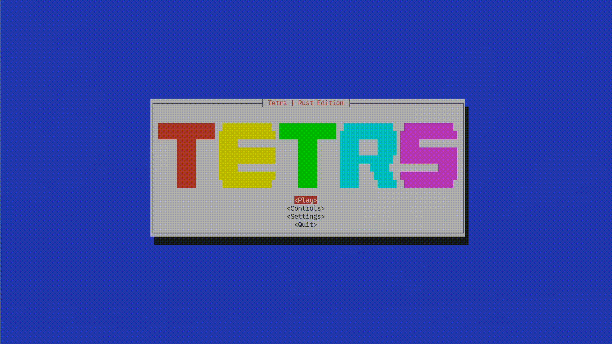

# Tetrs (tetrs-tui)
- Runs fully in the terminal.
- Used [Cursive TUI library](https://github.com/gyscos/cursive) and [Rodio for audio](https://github.com/RustAudio/rodio).
- Music synthesized from MIDI from [bitmidi.com](https://bitmidi.com/).

## Install
```
$ cargo install tetrs-tui
```
## Run 
```
$ cargo run -package tetrs-tui
```
or, if your Cargo binaries are on your path: 
```
$ tetrs
```
